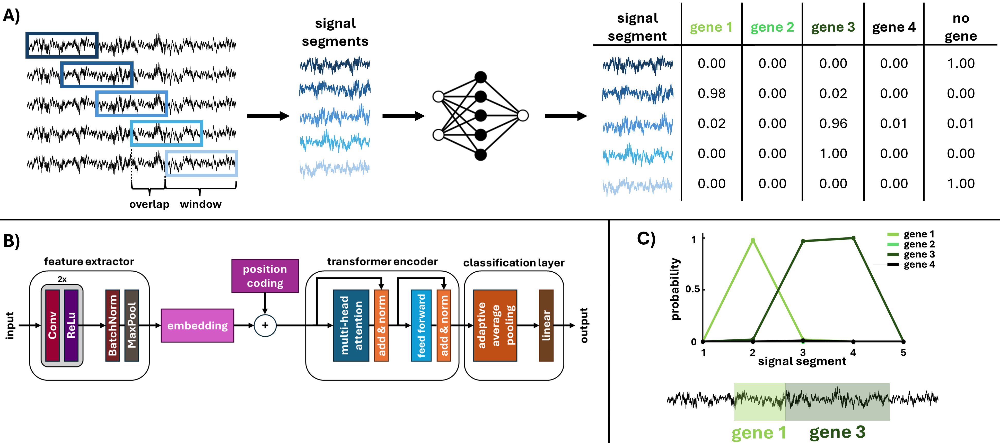

# NanoResFormer

A hybrid convolutional-transformer neural network for real-time antimicrobial resistance detection directly from Oxford Nanopore Technologies (ONT) raw signal data.



## Overview

NanoResFormer enables basecalling-free diagnostics by analyzing raw nanopore current signals (squiggles) to detect antimicrobial resistance genes during sequencing. This approach significantly reduces time-to-diagnosis and computational requirements compared to conventional basecalling-dependent workflows.

## Key Features

- **Direct Signal Analysis**: Processes raw ONT current signals without basecalling
- **High Accuracy**: Achieves 94.2% sensitivity and 3.2% false positive rate for resistance gene detection
- **Fast Processing**: Screens 1 million reads in 6.3 hours (~50% faster than basecalling alone)
- **Rapid Diagnosis**: Preliminary results available within 9 minutes of sequencing (24,000 reads)
- **Hybrid Architecture**: Combines convolutional layers with transformer-based attention mechanisms

## Clinical Applications

- Real-time antimicrobial resistance screening during sequencing
- Point-of-care diagnostics in clinical microbiology
- Rapid on-site clinical decision support
- Resource-efficient pathogen surveillance

## Installation

Due to flexibility across different devices (GPU/CPU), PyTorch is not included in `requirements.txt`.
**You must install it manually BEFORE running the application.**

1. **Install other dependencies:**
  ```bash
  pip install -r requirements.txt
  ```

2. **Install PyTorch:**
  Visit the official website https://pytorch.org/get-started/locally/ and choose the version matching your **CUDA version** and operating system.

  * **For CPU version (universal):**
    ```bash
    pip install torch torchvision torchaudio --index-url https://download.pytorch.org/whl/cpu
    ```
  * **For NVIDIA GPU (find your CUDA version via `nvidia-smi`):**
    ```bash
    pip install torch torchvision torchaudio --index-url https://download.pytorch.org/whl/cu121
    ```

## Usage

To run NanoResFormer inference on raw signals, use the following command in your terminal:

```bash
python NanoResFormer.py <csv_path> <out_dir> [--csv_name <csv_name>] [--OV <overlap_percentage>] [--Model <model_variant>] [--export_images] [--device_pref <device_preference>]
```

### Parameters

- `<csv_path>`: Path to the input CSV file containing raw signals.
- `<out_dir>`: Directory where results (CSV and optional images) will be saved.
- `--csv_name <csv_name>`: (Optional) Base name for output files (default uses input filename).
- `--OV <overlap_percentage>`: (Optional) Window overlap percentage (10-99). Default is 80.
- `--Model <model_variant>`: (Optional) Model variant to use. Choices are 'low', 'middle', 'high'. Default is 'middle'.
- `--export_images`: (Optional) If present, exports annotated images for each processed signal. Default is False.
- `--device_pref <device_preference>`: (Optional) Device selection preference: 'cpu', 'cuda', or 'auto'. Default is 'auto'.


### Example

```bash
python NanoResFormer.py signals.csv output_dir --csv_name results --OV 90 --Model high --export_images --device_pref cuda
```
with example data
```bash
python NanoResFormer.py data_example\signals.csv Results
```

## Performance

- **Sensitivity**: 94.2%
- **False Positive Rate**: 3.2%
- **Processing Speed**: 1M reads in 6.3 hours
- **Time to First Detection**: ~9 minutes (99.9% confidence)

## Requirements

- Python 3.12
- PyTorch 2.8
- ONT raw signal data (CSV format) in specific structure


## CSV Input Format

The input CSV file must follow a specific structure for each signal row:

```
ID,*,signal_value_1,signal_value_2,...,signal_value_n
```

### Format Requirements

- **ID**: Required identifier for each signal (first column)
- **Separator**: Asterisk (`*`) character that marks the boundary between metadata and signal data
- **Signal Values**: Numeric values (comma-separated) representing the raw nanopore current signal

### Validation Rules

1. Each signal row must contain the `*` separator
2. At least one column (ID) must exist before the `*`
3. At least one numeric signal value must exist after the `*`
4. All signal values after `*` must be valid numeric values (integer or float)

### CSV file example

```csv
read_001,*,120.5,118.3,122.1,119.7,121.8
read_002,*,115.2,117.9,116.4,118.1,119.3
read_003,*,114.8,120.2,118.5,121.0,119.6
```
**Note**: Rows without the `*` separator (such as headers) are automatically skipped during processing.

## License

See LICENSE file for details.

## Citation

If you use NanoResFormer in your research, please cite:

```bibtex
@software{nanoresformer,
  title={Basecalling-free resistance gene identification using a hybrid transformer in raw nanopore signals},
  author={Jakubicek R. et al.},
  year={2026}
}
```

## Contact

For questions and feedback, please open an issue on GitHub or contact us via email at [jakubicek@vutbr.cz](mailto:jakubicek@vutbr.cz) or [jakubickova@vut.cz](mailto:jakubickova@vut.cz).